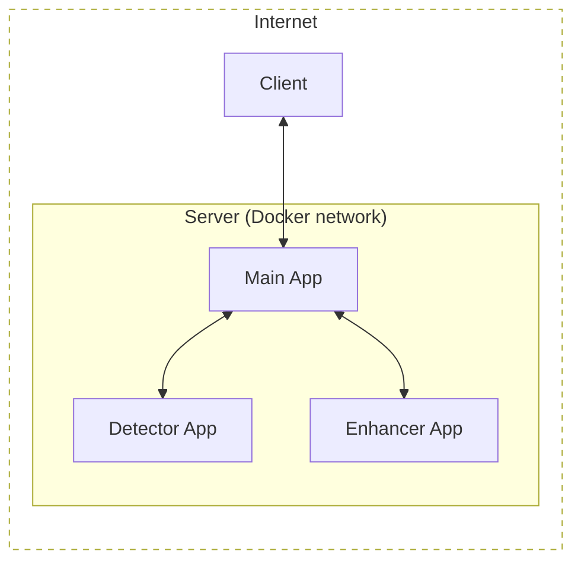
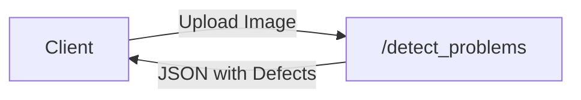
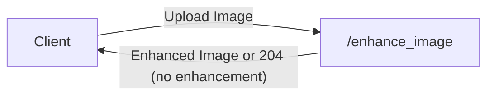
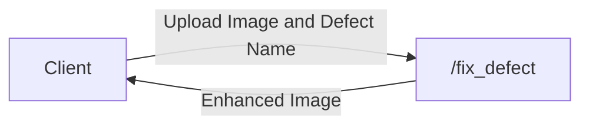
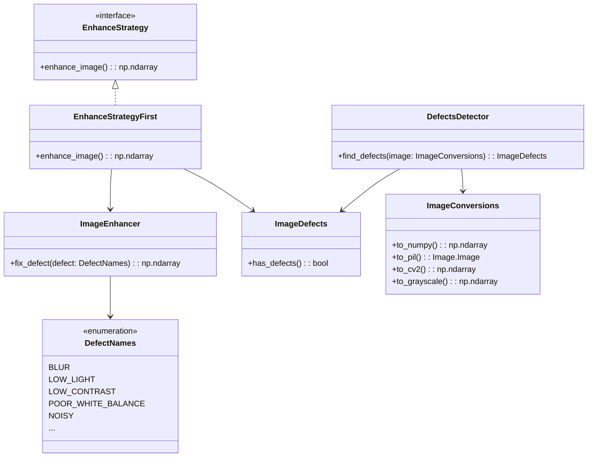

# AAA ML Курсовой проект


## Тема: 10. Автоулучшение фото

> Проект направлен на создание алгоритма, который повысит визуальное восприятие изображений недвижимости, загружаемых пользователями. Основная цель - улучшить такие параметры фото, как контрастность, насыщенность, яркость, шум, тени и др. Для этого планируется протестировать существующие open-source решения, дообучить их или разработать собственный алгоритм, основанный на нейронных сетях или классическом компьютерном зрении. Качество решения будет провалидировано с учетом субъективности визуальных улучшений. Финальный продукт будет реализован в виде микросервиса с временем ответа не более 1 секунды на фото и, возможно, с опцией ручной корректировки параметров.

## Команда

Название: Ассоциация Анонимных Аналитиков

- Ермаков Павел @pyrogn
- Иванов Артем @aert14

## Структура

- `src/aaa_image_enhancement/` - устанавливаемый Python проект с главным приложением
- `experiments/` - различный код
- `notebooks/` - ноутбуки с output, если потребуется для демонстрации
- `models/` - модели или fastapi приложения, задекларированные в Dockerfile
- `benchmarks/` - оценка производительности отдельных частей
- `demo/` - простой сервис для демонстрации работы исправления изображений
- `tests/` - тесты приложения
- **[Dual-Choice](https://github.com/pyrogn/aaa-dual-choice) - проект с оценкой субъективного качества фото**

## Запуск

### Демонстрация

- `docker compose --profiles demo up`
- Смотреть Flask приложение на порту 5555. К примеру, http://127.0.0.1:5555/
- Можно вставить множество картинок
- Картинки отправляются на эндпоинт `/enhance_image`. Слева — оригинальная фотография. Если улучшения нет, то правая фотография будет отсутствовать.


### Запуск бэкенда

- `docker compose up` для запуска главного приложения, приложения-детектора и приложения-улучшалки
- [Код главного приложения с описанием эндпоинтов](./src/aaa_image_enhancement/app.py)
- [Код приложения-детектора](./src/aaa_image_enhancement/detector_app.py)
- [Код приложения-улучшалки](./src/aaa_image_enhancement/enhancer_app.py)

### Бенчмарки

- Поднять сервис на сервере через `docker compose up`.
- Установить Rye на другом устройстве/сервере. Выполнить `rye sync`. (знаю, что сложно, возможно, подключу devcontainers)
- `python -m benchmarks.benchmark_app localhost` (вставить адрес сервера, который будем нагружать).

Пример результата:

```
❯ python -m benchmarks.benchmark_app --host 51.250.19.218 --rps 10
Processing images: 100%|█████████████████████████| 100/100 [00:10<00:00,  9.86it/s]
theoretical RPS: 10
actual RPS: 9.83
Total images processed: 100
Enhancements: 61
No enhancements needed: 39
Errors: 0
Average response time: 0.0922 seconds
95th percentile response time: 0.1877 seconds
99th percentile response time: 0.2132 seconds
99.9th percentile response time: 0.2476 seconds
```

### Тестирование

- `make test`

## Инфраструктура

- FastAPI, uvicorn
- Docker Compose
- pytest внутри Docker для тестирования

## Модели

- [Illumination-Adaptive-Transformer](https://github.com/cuiziteng/Illumination-Adaptive-Transformer)


## Архитектура

Это эксперимент в [mermaid](https://mermaid.js.org/).

### Архитектура системы



### API





### Code structure

Сложно передать диаграммой, здесь поверхностно и упущена часть взаимодействий, но по сути.

Пояснения:
- `ImageConversions` - вспомогательный класс для манипулирования картинками.
- `ImageDefects` - это датакласс, который создаётся из Enum `DefectsNames` и используется для передачи информации о дефектах.
- `DefectsDetector`  содержит в себе список из функций-детекторов, которые по картинке выдают найденные дефекты, которые будут отображены в возвращаемом `ImageDefects`.
- `ImageEnhancer` имеет мапу из функций (DefectNames => Callable), и для конкретного дефекта вызывает соответсвующую функцию для исправления.
- `EnhanceStrategy` нужен для принятия решения об исправлении ряда дефектов. К примеру, исправляет только первый (самый важный) в EnhanceStrategyFirst. Или все дефекты, и надо соответствовать интерфейсу.



## Работа с репозиторием
[](https://rye-up.com) [](https://github.com/astral-sh/ruff)

- Относимся к main ветке осторожно, добавляем коммиты через PR. Работаем в своей ветке.
- Используем пакетный менеджер [Rye](https://github.com/astral-sh/rye) (`rye sync --all-features`).
- Не заливаем данные:
  - В jupyter notebook перед отправкой удаляем весь output (Папка `notebooks/` добавлена в исключение, там может быть output).
  - Картинки и гифки не оставляем в репо, а заливаем на хранилище GitHub через вставку через веб-интерфейс.
- Прогоняем код через Ruff (`rye run lint`, source находится в pyproject). Индивидуально: (`rye lint --fix`, `rye fmt`, либо `ruff check --fix`, `ruff format`).
- Проверяем тесты `rye test` или `pytest`.
- Все или почти все эти операции можно включить через `pre-commit install`. Можно запустить все проверки через `rye run pre` или `pre-commit run --all-files`.
- Если инструмент работает некорректно, можно добавлять точечно `noqa: <code>`, `type: ignore` или добавить исключения в конфиге в `pyproject.toml`. Или подредактировать `.pre-commit-config.yaml`.
- Можно переносить и переименовывать файлы, функции, переменные. Но только через рефакторинг (как F2 или Refactor... в VSCode), чтобы ничего не сломалось.
- ~~Типизация `mypy ./src`~~
