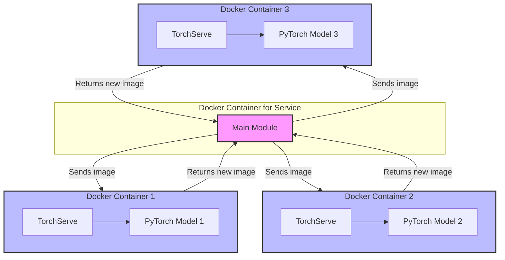
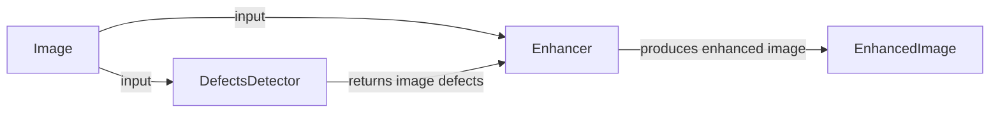
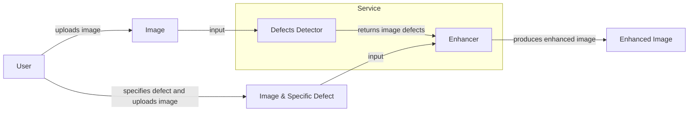
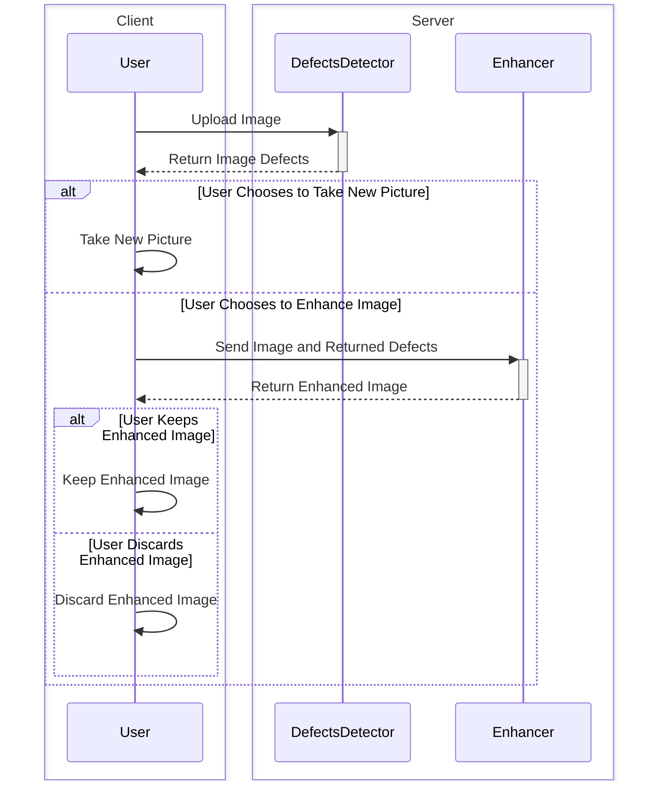

# AAA ML Курсовой проект

## Тема: 10. Автоулучшение фото

> Проект направлен на создание алгоритма, который повысит визуальное восприятие изображений недвижимости, загружаемых пользователями. Основная цель - улучшить такие параметры фото, как контрастность, насыщенность, яркость, шум, тени и др. Для этого планируется протестировать существующие open-source решения, дообучить их или разработать собственный алгоритм, основанный на нейронных сетях или классическом компьютерном зрении. Качество решения будет провалидировано с учетом субъективности визуальных улучшений. Финальный продукт будет реализован в виде микросервиса с временем ответа не более 1 секунды на фото и, возможно, с опцией ручной корректировки параметров.

## Команда

Название: Ассоциация Анонимных Аналитиков

- Ермаков Павел @pyrogn
- Иванов Артем @aert14

## Структура

(обновлять)

- `src/aaa_image_enhancement/` - устанавливаемый Python проект с главным приложением
- `experiments/` - различный код
- `notebooks/` - ноутбуки с output, если потребуется для демонстрации
- `models/` - модели, поднимаемые через `docker`
- `benchmarks/` - оценка производительности отдельных частей
- `demo/` - простой сервис для демонстрации работы детекции и исправления
- **[Dual-Choice](https://github.com/pyrogn/aaa-dual-choice)** - проект с оценкой субъективного качества фото

## Запуск

### Демонстрация

- `docker compose --profiles demo up`
- http://127.0.0.1:5555/
- Можно вставить множество картинок
- Картинки отправляются на эндпоинт /enhance_image. Слева — оригинальная фотография. Если улучшения нет, то правая фотография будет отсутствовать.

### Запуск бэкенда

- `docker compose up`
- [Код приложения с описанием эндпоинтов](./src/aaa_image_enhancement/app.py)

### Бенчмарки

- Поднять сервис на сервере через предыдущую команду.
- `python -m benchmark.benchmark_app localhost` (вставить адрес сервера, который будем нагружать). Например `python -m benchmark.benchmark_app --host 51.250.19.218 --rps 10`.

## Работа с репозиторием
 

- Относимся к main ветке осторожно, добавляем коммиты через PR. Работаем в своей ветке.
- Используем пакетный менеджер [Rye](https://github.com/astral-sh/rye) (`rye sync --all-features`).
- Не заливаем данные:
  - В jupyter notebook перед отправкой удаляем весь output (Папка `notebooks/` добавлена в исключение, там может быть output).
  - Картинки и гифки не оставляем в репо, а заливаем на хранилище GitHub через вставку через веб-интерфейс.
- Прогоняем код через Ruff (`rye run lint`, source находится в pyproject). Индивидуально: (`rye lint --fix`, `rye fmt`, либо `ruff check --fix`, `ruff format`).
- Проверяем тесты `rye test` или `pytest`.
- Все или почти все эти операции можно включить через `pre-commit install`. Можно запустить все проверки через `rye run pre` или `pre-commit run --all-files`.
- Если инструмент работает некорректно, можно добавлять точечно `noqa: <code>`, `type: ignore` или добавить исключения в конфиге в `pyproject.toml`. Или подредактировать `.pre-commit-config.yaml`.
- Можно переносить и переименовывать файлы, функции, переменные. Но только через рефакторинг (как F2 или Refactor... в VSCode), чтобы ничего не сломалось.
- ~~Типизация `mypy ./src`~~
- More to come...

## Инфраструктура

- https://pytorch.org/serve/
- FastAPI
- Docker, Docker Compose

  
Тренировка

## Модели

- model1 (github link, citation)

## Архитектура

Это эксперимент в [mermaid](https://mermaid.js.org/).

### Autonomous

### Interactive with User

